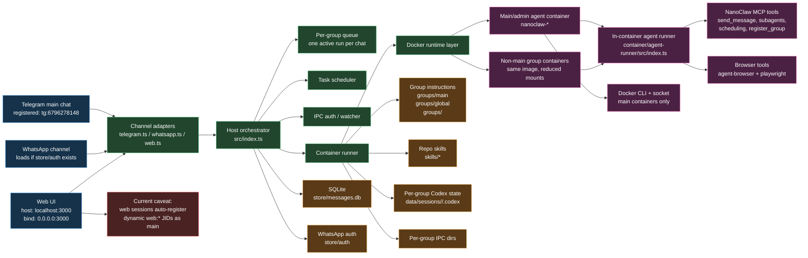

# NanoClaw Actual Architecture

This diagram is drawn from [RUNTIME_AUDIT.md](/home/johnohhh1/nanoclaw/docs/RUNTIME_AUDIT.md), not from older design prose.

It describes the current live port on this machine as of `2026-03-26`.

## Actual Runtime Diagram

## Actual Control Boundaries

### Host-side control

- [src/index.ts](/home/johnohhh1/nanoclaw/src/index.ts) is the real orchestrator
- it owns:
  - channel startup
  - message storage
  - queueing
  - task scheduling
  - group registration
  - container launch/resume

### Container-side control

- [container/agent-runner/src/index.ts](/home/johnohhh1/nanoclaw/container/agent-runner/src/index.ts) builds the agent prompt and invokes Codex
- [container/agent-runner/src/ipc-mcp-stdio.ts](/home/johnohhh1/nanoclaw/container/agent-runner/src/ipc-mcp-stdio.ts) exposes the MCP tool surface

### Real persistent state

- [store/messages.db](/home/johnohhh1/nanoclaw/store/messages.db)
- [groups](/home/johnohhh1/nanoclaw/groups)
- [skills](/home/johnohhh1/nanoclaw/skills)
- [data/sessions](/home/johnohhh1/nanoclaw/data/sessions)
- [store/auth](/home/johnohhh1/nanoclaw/store/auth)

## Actual Main-Container Mount Set

```mermaid
flowchart TB
    classDef host fill:#5a3a17,color:#fff,stroke:#ffc36b,stroke-width:1px;
    classDef ctr fill:#4b2143,color:#fff,stroke:#ff8ccc,stroke-width:1px;

    P["Host project root\n/home/johnohhh1/nanoclaw"]:::host
    E["Host .env\nshadowed with /dev/null"]:::host
    G["Host main group folder\ngroups/main or web_ui"]:::host
    S["Host repo skills\nskills/"]:::host
    C["Host per-group Codex state\ndata/sessions/<group>/.codex"]:::host
    I["Host per-group IPC dir"]:::host
    SRC["Host live runner src\ncontainer/agent-runner/src"]:::host
    SOCK["Host Docker socket\n/var/run/docker.sock"]:::host

    WPROJ["/workspace/project\nrw"]:::ctr
    WENV["/workspace/project/.env\n/dev/null ro"]:::ctr
    WGROUP["/workspace/group\nrw"]:::ctr
    WSK["/workspace/skills-catalog"]:::ctr
    HOME["/home/node/.codex"]:::ctr
    WIPC["/workspace/ipc"]:::ctr
    APPSRC["/app/src\nlive bind mount"]:::ctr
    DSOCK["/var/run/docker.sock"]:::ctr

    P --> WPROJ
    E --> WENV
    G --> WGROUP
    S --> WSK
    C --> HOME
    I --> WIPC
    SRC --> APPSRC
    SOCK --> DSOCK
```

## Actual Runtime Flow

1. Message enters through Telegram, WhatsApp, or Web UI.
2. Channel adapter normalizes it.
3. Host orchestrator stores it in SQLite.
4. The queue decides whether that group should run now.
5. The host launches a per-group Docker container.
6. The container runner injects:
   - group/global instructions
   - repo skills
   - skill index
   - channel-specific guidance
7. Codex runs inside the container.
8. The agent may call MCP tools for messages, subagents, tasks, or group registration.
9. Output streams back to the host and out through the owning channel.

## Current Truthful Caveats

- Web UI is host-served, not container-served.
  - Browser uses `localhost:3000`
  - Agent containers must use `host.docker.internal:3000`
- Web UI registration is currently dynamic-session-based and operationally messy.
- The audit is more accurate than older architecture prose.
- Service env, repo `.env`, built `dist`, and the Docker image can drift from one another.

## See Also

- [RUNTIME_AUDIT.md](/home/johnohhh1/nanoclaw/docs/RUNTIME_AUDIT.md)
- [OPS_ARCHITECTURE_DIAGRAM.md](/home/johnohhh1/nanoclaw/docs/OPS_ARCHITECTURE_DIAGRAM.md)
