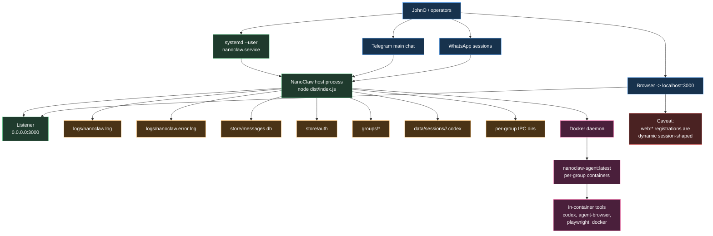
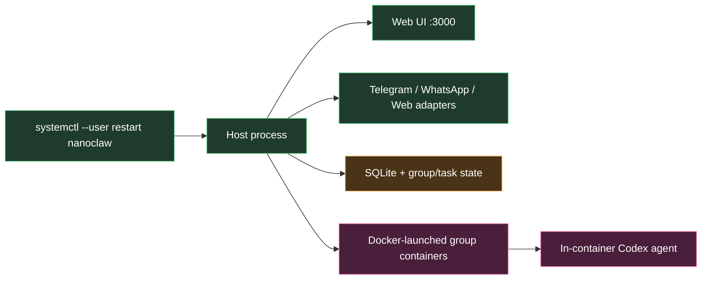

# NanoClaw Actual Ops Diagram

This is the ops view of the live port, redrawn from [RUNTIME_AUDIT.md](/home/johnohhh1/nanoclaw/docs/RUNTIME_AUDIT.md).

It is meant to answer:
- what is actually running
- what listens on what
- where state lives
- what to restart
- where failures are isolated

## Actual Ops Topology



## Current Restart / Debug Boundaries



## Current Failure Domains

### If the user service fails

- Web UI disappears from `:3000`
- Telegram and WhatsApp stop replying
- no new agent containers start

### If Docker fails

- host service can still run
- channel ingestion/storage may still work
- all actual agent execution fails

### If SQLite fails

- messages, registered groups, task state, and routing/session state all degrade together

### If one group container fails

- that group stalls or retries
- other groups can still run

## Current Live Ops Facts

- user service: `nanoclaw.service`
- host listener: `0.0.0.0:3000`
- agent image: `nanoclaw-agent:latest`
- Docker socket mounting: enabled in live user unit
- Telegram main group: registered and main
- Web UI group: registered and main, but currently session-shaped

## Fast Checks

```bash
systemctl --user status nanoclaw --no-pager
systemctl --user cat nanoclaw
ss -ltnp | rg ':3000\\b'
curl -s http://localhost:3000/api/health
tail -n 50 logs/nanoclaw.log
tail -n 50 logs/nanoclaw.error.log
docker ps --format '{{.Names}} {{.Status}}' | rg '^nanoclaw-'
sqlite3 store/messages.db "select jid, name, folder, ifnull(is_main,0), ifnull(requires_trigger,1) from registered_groups order by folder;"
```

## See Also

- [RUNTIME_AUDIT.md](/home/johnohhh1/nanoclaw/docs/RUNTIME_AUDIT.md)
- [ACTUAL_VS_DESIRED.md](/home/johnohhh1/nanoclaw/docs/ACTUAL_VS_DESIRED.md)
